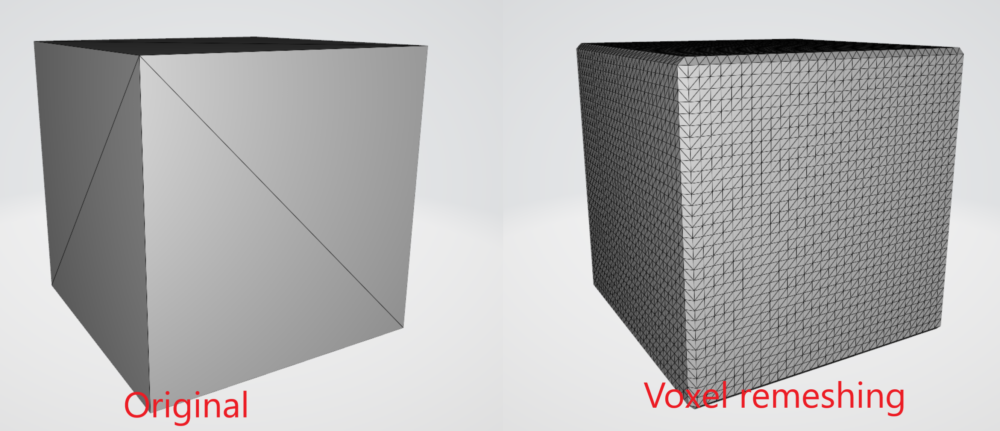

# Geometry processing library in pure Rust

## :exclamation: Under development. API may change.

## Features
- Corner table implementation for efficient mesh traversal
- STL reader/writer
- Remeshing
- Mesh simplification (decimation)
- 2D triangulation
- Spatial index
    * Bounding volume hierarchy of axis aligned bounding boxes
    * Infinite grid

## Reading/writing mesh from/to STL file
You can read/write STL files using `StlReader` and `StlWriter` structs. Ony binary STLs are supported.

### Example
```rust
use std::path::Path;

use baby_shark::{
    io::stl::{StlReader, StlWriter}, 
    mesh::corner_table::prelude::CornerTableF
};

fn main() {
    let mut reader = StlReader::new();
    let mesh: CornerTableF = reader.read_stl_from_file(Path::new("./read.stl"))
        .expect("Read mesh from STL file");

    let writer = StlWriter::new();
    writer.write_stl_to_file(&mesh, Path::new("./write.stl"))
        .expect("Save mesh to STL file");
}
```

## Isotropic remeshing
This algorithm incrementally performs simple operations such as edge splits, edge collapses, edge flips, and Laplacian smoothing. 
All the vertices of the remeshed patch are reprojected to 
the original surface to keep a good approximation of the input.
Any of those operations can be turned off using appropriate method (`with_<operation>(false)`).


### Example
```rust
let remesher = IncrementalRemesher::new()
    .with_iterations_count(10)
    .with_split_edges(true)
    .with_collapse_edges(true)
    .with_flip_edges(true)
    .with_shift_vertices(true)
    .with_project_vertices(true);
remesher.remesh(&mut mesh, 0.002f32);
```

## Voxel remeshing
*Voxel remeshing* is a computational process used in computer graphics to reconstruct or optimize the topology of a three-dimensional (3D) model.
Voxels are volumetric pixels that make up the 3D space, and remeshing involves reorganizing these voxels to create a more uniform and well-defined mesh structure.
Also, it comes with the benefit of removing overlapping geometry, a valuable asset in sculpting applications.



### Example
```rust
use baby_shark::{
    mesh::{builder, polygon_soup::data_structure::PolygonSoup},
    remeshing::voxel::VoxelRemesher,
};
use nalgebra::Vector3;

fn main() {
    let mesh: PolygonSoup<f32> = builder::cube(Vector3::zeros(), 1.0, 1.0, 1.0);
    let mut remesher = VoxelRemesher::default().with_voxel_size(0.02);
    let remeshed = remesher.remesh(&mesh).unwrap();
}
```

## Mesh simplification (decimation)
This library implements incremental edge decimation algorithm. On each iteration edge with lowest collapse cost is collapsed.
Several stop condition are supported:
* *Max error* - algorithm stops when collapse lowest cost is bigger than given value
* *Min faces count* - algorithm stops when faces count drops below given value
* *Bounding sphere* - adaptive error algorithm based upon distance from a point. Useful for LOD mesh decimation.


### Example
```rust
    let mut decimator = EdgeDecimator::new()
        .decimation_criteria(ConstantErrorDecimationCriteria::new(0.0005))
        .min_faces_count(Some(10000));
    decimator.decimate(&mut mesh);
```

### Bounded Sphere Example
```rust
    let origin = Point3::<f32>::origin();
    let radii_error_map = vec![
        (10.0f32, 0.0001f32),
        (15.0f32, 0.05f32),
        (40.0f32, 0.8f32),
    ];

    let criteria = BoundingSphereDecimationCriteria::new(origin, radii_error_map);

    let mut decimator = EdgeDecimator::new().decimation_criteria(criteria);
    decimator.decimate(&mut mesh);
```

## 2D triangulation
`Triangulation2` struct implements fast 2D delaunay triangulation of points set.


### Example
```rust
let mut triangulation = Triangulation2::new();
triangulation.triangulate(&vec![
    Point2::new(1.0, 2.0),
    Point2::new(5.0, 1.0),
    Point2::new(8.0, 6.0),
    Point2::new(2.0, 8.0)
]);
```

## Constrained 2D triangulation
The `ConstrainedTriangulation2` struct facilitates the constrained triangulation of a set of points. It builds upon the unconstrained Delaunay triangulation by inserting constrained edges. However, it's important to note that the resulting triangulation may not always be a Delaunay triangulation.

Conflicting constraints are automatically resolved through the following steps:
* When a new constrained edge intersects with another constrained edge, both edges are split into two at the intersection point
* When a new constrained edge intersects with a point, the edge is split into two at that point


### Example
```rust
let points = vec![
    Point2::new(-3.0, 1.0),
    Point2::new(0.0, 0.0),
    Point2::new(0.0, 4.0),
    Point2::new(3.0, 2.0),
    Point2::new(6.0, 0.0),
    Point2::new(6.0, 4.0),
    Point2::new(9.0, 2.0)
];
let mut tri = ConstrainedTriangulation2::from_points(&points);
tri.insert_constrained_edge(0, 6);
```
