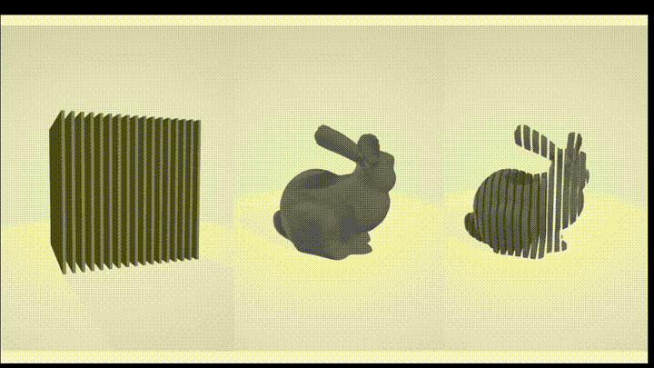
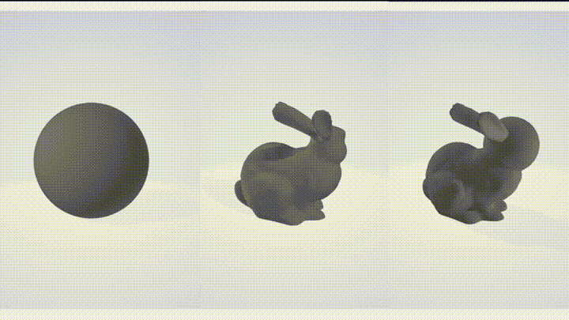
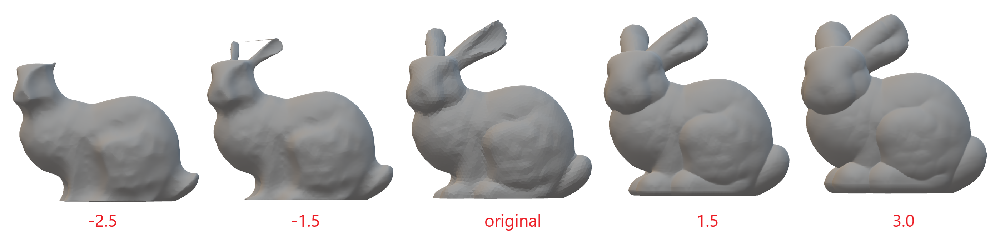

# Geometry processing library in pure Rust
    
[](https://crates.io/crates/baby_shark)


# Features
- Implicit/voxel/volume modeling
    - Voxel remeshing
    - Boolean operations
    - Offsetting
- Explicit modeling
    - Mesh simplification (decimation)
    - Isotropic remeshing

# IO
## Reading and writing mesh files
The library supports reading and writing mesh files in multiple formats with automatic format detection based on file extension:

- **STL** (binary only) - Widely used for 3D printing and CAD
- **OBJ** - Common format for graphics applications

The `read_from_file` and `write_to_file` functions automatically detect the format from the file extension and use the appropriate reader/writer.

### Example
```rust
use std::path::Path;
use baby_shark::{
    io::{read_from_file, write_to_file}, 
    mesh::corner_table::prelude::CornerTableF
};

fn main() {
    // Read mesh - format automatically detected from extension
    let mesh: CornerTableF = read_from_file(Path::new("./input.stl"))
        .expect("Failed to read mesh file");

    // Write mesh - format automatically detected from extension  
    write_to_file(&mesh, Path::new("./output.obj"))
        .expect("Failed to write mesh file");
}
```

### Advanced usage with specific readers/writers
For more control, you can use format-specific readers and writers directly:

```rust
use baby_shark::io::{StlReader, StlWriter, ObjReader};

// Using specific readers
let mut stl_reader = StlReader::new();
let mesh = stl_reader.read_from_file(Path::new("./mesh.stl"))?;

let mut obj_reader = ObjReader::new(); 
let mesh = obj_reader.read_from_file(Path::new("./mesh.obj"))?;

// Using specific writers
let stl_writer = StlWriter::new();
stl_writer.write_to_file(&mesh, Path::new("./output.stl"))?;
```

# Implicit modeling
## Boolean operations
Boolean operations are a set of operations that can be performed on volumes to combine or modify their shapes. The supported boolean operations in this library are:

* *Union* - combines two volumes into a single volume, resulting in a shape that includes the combined volume of both models.
* *Subtract* - removes the volume from another, resulting in a shape that is the difference between the two models.
* *Intersect* - returns the volume that is common to both models, resulting in a shape that includes only the overlapping region.

These boolean operations can be useful in various applications, such as creating complex shapes by combining simpler shapes, removing unwanted parts from a volume, or finding the intersection between two volumes.

### [Example](examples/boolean.rs)

Subtract           |  Union
:-----------------:|:----------------:
 | 

## Volume offset
The volume offsetting allows for the expansion or contraction of a model shape, serving various applications like CNC machining, collision detection, and rapid prototyping. It's a vital tool in model generation and toolpath creation. Inwards and outwards offsets are supported.

### [Example](examples/offset.rs)



## Voxel remeshing
*Voxel remeshing* is a computational process used in computer graphics to reconstruct or optimize the topology of a three-dimensional (3D) model.
Voxels are volumetric pixels that make up the 3D space, and remeshing involves reorganizing these voxels to create a more uniform and well-defined mesh structure.
Also, it comes with the benefit of removing overlapping geometry, a valuable asset in sculpting applications.

### [Example](examples/voxel_remeshing.rs)


# Explicit modeling
## Isotropic remeshing
This algorithm incrementally performs simple operations such as edge splits, edge collapses, edge flips, and Laplacian smoothing. 
All the vertices of the remeshed patch are reprojected to 
the original surface to keep a good approximation of the input.
Any of those operations can be turned off using appropriate method (`with_<operation>(false)`).


### Example
```rust
let remesher = IncrementalRemesher::new()
    .with_iterations_count(10)
    .with_split_edges(true)
    .with_collapse_edges(true)
    .with_flip_edges(true)
    .with_shift_vertices(true)
    .with_project_vertices(true);
remesher.remesh(&mut mesh, 0.002f32);
```

## Mesh simplification (decimation)
This library implements incremental edge decimation algorithm. On each iteration edge with lowest collapse cost is collapsed.
Several stop condition are supported:
* *Max error* - algorithm stops when collapse lowest cost is bigger than given value
* *Min faces count* - algorithm stops when faces count drops below given value
* *Bounding sphere* - adaptive error algorithm based upon distance from a point. Useful for LOD mesh decimation.


### Example
```rust
let mut decimator = EdgeDecimator::new()
    .decimation_criteria(ConstantErrorDecimationCriteria::new(0.0005))
    .min_faces_count(Some(10000));
decimator.decimate(&mut mesh);
```

### Bounded Sphere Example
```rust
let origin = Point3::<f32>::origin();
let radii_error_map = vec![
    (10.0f32, 0.0001f32),
    (15.0f32, 0.05f32),
    (40.0f32, 0.8f32),
];

let criteria = BoundingSphereDecimationCriteria::new(origin, radii_error_map);

let mut decimator = EdgeDecimator::new().decimation_criteria(criteria);
decimator.decimate(&mut mesh);
```
